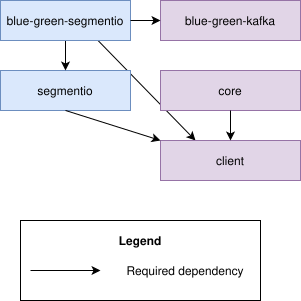

# MaaS go client
Go client to preform operations with MaaS

<!-- TOC -->
* [MaaS go client](#maas-go-client)
  * [Kafka](#kafka)
    * [MaaS Kafka client API](#maas-kafka-client-api)
    * [Get/Create/Delete topic from non default kafka instance](#getcreatedelete-topic-from-non-default-kafka-instance)
    * [Create MaaS Kafka go client with Cloud-Core default configuration](#create-maas-kafka-go-client-with-cloud-core-default-configuration)
    * [Use MaaS Kafka client with https://github.com/segmentio/kafka-go](#use-maas-kafka-client-with-httpsgithubcomsegmentiokafka-go)
    * [Implement messages consumption from Kafka topic in Blue-Green scenarios with https://github.com/segmentio/kafka-go](#implement-messages-consumption-from-kafka-topic-in-blue-green-scenarios-with-httpsgithubcomsegmentiokafka-go)
    * [Libraries dependency graph:](#libraries-dependency-graph)
  * [Rabbit](#rabbit)
    * [MaaS Rabbit client API](#maas-rabbit-client-api)
    * [Create MaaS Rabbit go client with Cloud-Core default configuration](#create-maas-rabbit-go-client-with-cloud-core-default-configuration)
  * [Retry behaviour](#retry-behaviour)
<!-- TOC -->

## Kafka
MaaS Kafka client to preform MaaS operations related to Kafka

### MaaS Kafka client API
[see API documentation](./kafka/api.go)

### Get/Create/Delete topic from non default kafka instance
Use 'Instance designators' feature in MaaS to control which kafka instance should be used. See this [documentation](https://github.com/netcracker/qubership-maas/blob/main/README.md#instance-designators)

### Create MaaS Kafka go client with Cloud-Core default configuration
To create MaaS kafka go client with Cloud-Core defaults use the following library extension
[libs/go/maas/core](https://github.com/netcracker/qubership-core-lib-go-maas-core)

### Use MaaS Kafka client with https://github.com/segmentio/kafka-go
To create pre-configured segmentio/kafka-go reader/writer/client structs via MaaS use the following extension
[libs/go/maas/segmentio](https://github.com/netcracker/qubership-core-lib-go-maas-segmentio)

### Implement messages consumption from Kafka topic in Blue-Green scenarios with https://github.com/segmentio/kafka-go
To create Blue-Green aware Kafka consumer use the following extension
[libs/go/maas/blue-green-segmentio](https://github.com/netcracker/qubership-core-lib-go-maas-bg-segmentio)

### Libraries dependency graph:

## Rabbit
MaaS Rabbit client to preform MaaS operations related to Rabbit

### MaaS Rabbit client API
[see API documentation](./rabbit/api.go)

### Create MaaS Rabbit go client with Cloud-Core default configuration
To create MaaS rabbit go client with Cloud-Core defaults use the following library extension
[libs/go/maas/core](https://github.com/netcracker/qubership-core-lib-go-maas-core)

## Retry behaviour

Every CRUD call to maas-agent (Kafka and Rabbit alike) is retried, bounded by a
single setting: `CrudClient.MaxTotalDuration` (`util.DefaultMaxTotalDuration`,
60s), the total duration of one call, retries included. The pauses and how many
attempts fit derive from it: the first pause is `util.DefaultRetryInterval`,
each next one doubles, and the cap is a quarter of the total. Pauses carry
+/-20% jitter so concurrent callers do not retry in lockstep.

The deadline travels on the context handed to each attempt, so `AttemptTimeout`
(`util.DefaultAttemptTimeout`, 30s) can never overrun it, and a shorter caller
deadline still wins.

`NewClient` reads `util.DefaultMaxTotalDuration` when it builds the client, so
change it before constructing one. A response the client cannot parse is not
retried: the same server answers the same way, so repeating it only delays the
error.

The 60s default is meant to outlast a database leader switchover while still
failing fast enough to react to a real outage.

Which responses are retried:

| Response | Retried | Why |
|---|---|---|
| transport error | yes | connection refused/reset while the agent is being rescheduled |
| 5xx | yes | includes the `500` maas-agent returns when it cannot reach maas-service at all |
| 429 | yes | throttling |
| **405** | **only when the `reason` names a database that cannot be written** | maas-service maps PostgreSQL error `25006` (READ ONLY SQL TRANSACTION) to `405`, so a write against a demoted Patroni node during a switchover arrives as `405`, not as `5xx`. A plain `405` — a route removed on the server, an ingress rejecting the method — is permanent and fails fast |
| 401 | no | the token provider refreshes on its own schedule, so a retry within the backoff re-sends the same token |
| other 4xx | no | permanent client errors, failed on the first attempt |

The 405 entry is deliberate: the usual "retry 5xx, fail fast on 4xx" rule does
not survive a database leader switchover here.

The `reason` of the error envelope is what decides, not the error code: every
maas-service error carries the same code, so the envelope alone says nothing. The
match is loose — the reason has to mention a database together with `read-only`
or `not active` — so a reworded message on the server still counts, while a `405`
about a read-only *field* does not.

`DeleteTopic` is retried like any other call: it reports only an error, so a
repeat of a delete whose response was lost answers the same as the first
attempt. The Java client excludes it, because there the response carries a count
of deleted topics that a repeat would report as zero.

The watch endpoint is excluded: it is a long poll with its own loop and its own
backoff, and its window derives from the HTTP client timeout so that
maas-service answers before the client gives up.

Retries live in this library only. The resty client from
`qubership-core-lib-go-maas-core` is built without its own retries and without a
client-wide timeout — see its README for why.

`util.Retry{Attempts, Interval}` and `util.NewRetry(attempts, interval)` are
still available for callers that bound work by attempt count; the clients use
`util.NewRetryWithin(maxTotal)`. Three details of `Retry.Run` changed for those
callers: a zero `Attempts` now runs the task once with the package defaults
instead of skipping it entirely, the last failure is returned as it is instead of
wrapped in `failed after N retries`, and there is no pause after the final
attempt.

`GetTopic`/`GetVhost` keep treating `404` as "not found" and return `nil` after
a single request.
